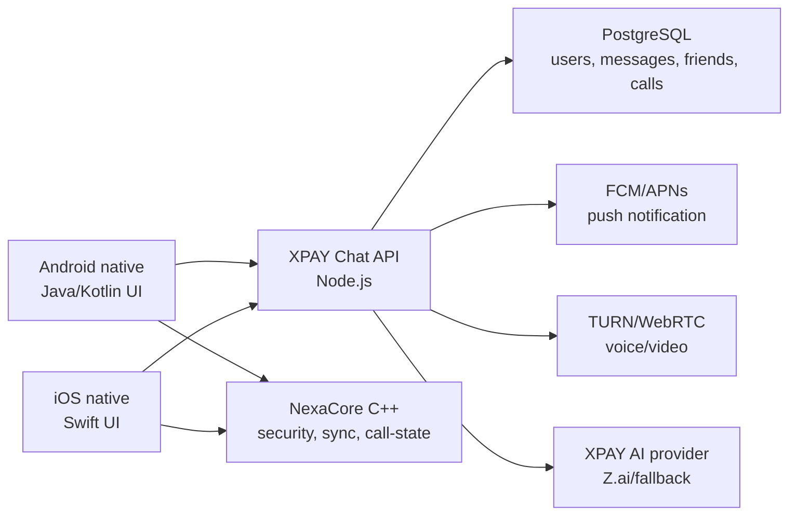

# XPAY Chat Native Roadmap

Muc tieu cua ban native la dua XPAY Chat di theo huong ung dung chat lon nhu Telegram: giao dien native rieng cho Android/iOS, core xu ly tach rieng, backend va PostgreSQL hien tai duoc giu nguyen de khong mat du lieu nguoi dung.

## Nguyen tac an toan

- Khong thay the ban web/Capacitor dang chay khi chua test xong.
- Khong tao kho du lieu moi cho tai khoan that. Native app phai goi API hien tai va dung token hien tai.
- Khong ghi de, reset, hoac migrate destructive tren PostgreSQL.
- Native preview dung package rieng de co the cai song song voi ban APK hien tai.
- Moi thay doi production sau nay phai di theo quy tac: giu nguyen data cu, chi thay doi dung phan duoc yeu cau.

## Kien truc theo huong Telegram

## Giai doan thuc hien

1. Native seed: tao API contract, NexaCore C++, Android native preview.
2. Android native suite: dang nhap, dang ky OTP, dong bo danh ba, hoi thoai, gui tin nhan text/media/vi tri, nhat ky, ho so, cai dat, signaling call, bo cuc thao tac giong ban HTML.
3. Android call WebRTC: am thanh/video native hai chieu, loa trong/loa ngoai, mic, ringtone, push call.
4. Android media/location: gui anh, video, vi tri hien tai.
5. XPAY AI native: tab rieng, goi `/api/ai/assistant`, hien thi lich/nhac viec.
6. iOS Swift: lap lai cac man hinh va API contract, khong doi du lieu.
7. Core C++ nang cao: ma hoa dau cuoi, hang doi offline, retry sync, call state.

## Vi sao khong viet lai mot lan

Neu viet lai toan bo mot lan va thay production ngay, rui ro lon nhat la hong dang nhap, mat dong bo, loi goi dien, hoac anh huong tai khoan that. Cach dung nhat la tao ban native song song, test voi API that, sau do moi thay tung lop.
